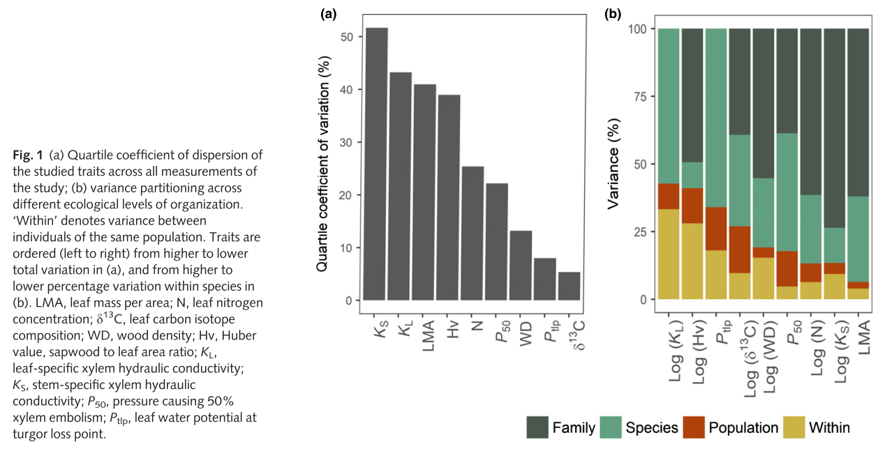

# Literature

## @Hajek2016

* ITV hydraulics unknown (even temperate)
* high intra-site but low inter-site/provenance variation of hydraulic traits
* P88 show significant genetic differentiation with provenance

## @Lobo2018

* Non-significant variation of P50 in Quercus petraea

## @Westerband2021

* Huge review on ITV
* Hydraulic ITV is understudied
* 6 to 42 % for hydraulic properties depending on the trait (Rosas et al., 2019)

## @Martinez-Vilalta2009

* leaf-specific hydraulic conductivity (KS and KL), vulnerability to embolism
* between-population variability was high for most of the hydraulic traits studied, but it was directly associated with climate dryness

## @Rosas2019

* inter- and intraspecific variability of LMA, N, d13C, WD, Hv, Hydraulic conductivity, P50
* Family explained the largest amount of variability 
* Intraspecific variability was also relevant
* Species occupying wetter sites showed higher N, P50 and Ptlp, and lower LMA, d13C and Hv. 
* Within species water explained Hv and Ptlp

```{r rosas2019, echo=F}

```

